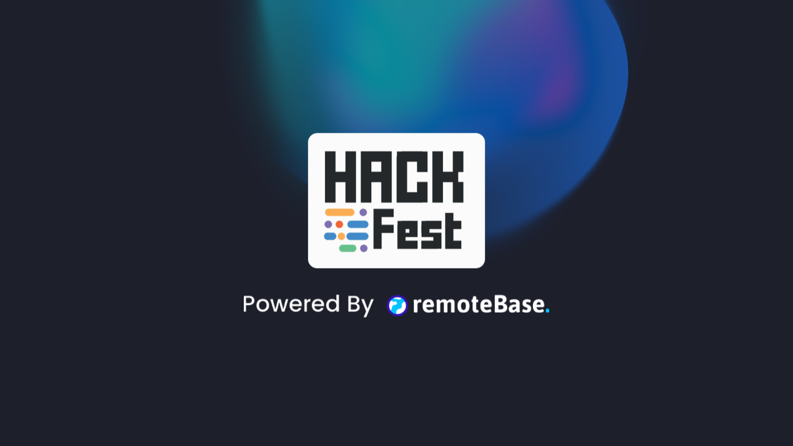

<p align="center">
  <a href="" rel="noopener">
 </a>
</p>
<h3 align="center">DermiTrack</h3>

<div align="center">


</div>

---

<p align="center"> A Simple tool for tracking your Skin related Diseases
    <br> 
</p>

## 📝 Table of Contents

- [📝 Table of Contents](#-table-of-contents)
- [🧐 Problem Statement <a name = "problem_statement"></a>](#-problem-statement-)
- [💡 Idea / Solution <a name = "idea"></a>](#-idea--solution-)
- [⛓️ Dependencies / Limitations <a name = "limitations"></a>](#️-dependencies--limitations-)
- [🚀 Future Scope <a name = "future_scope"></a>](#-future-scope-)
- [🏁 Getting Started <a name = "getting_started"></a>](#-getting-started-)
  - [Prerequisites](#prerequisites)
  - [Project Setup](#project-setup)
- [🎈 Usage <a name="usage"></a>](#-usage-)
- [⛏️ Built With <a name = "tech_stack"></a>](#️-built-with-)
- [✍️ Authors <a name = "authors"></a>](#️-authors-)

## 🧐 Problem Statement <a name = "problem_statement"></a>

It is useful to design and follow a specific format when writing a problem statement. While there are several options
for doing this, the following is a simple and straightforward template often used in Business Analysis to maintain
focus on defining the problem.

- IDEAL: This section is used to describe the desired or “to be” state of the process or product. At large, this section
  should illustrate what the expected environment would look like once the solution is implemented.
- REALITY: This section is used to describe the current or “as is” state of the process or product.
- CONSEQUENCES: This section is used to describe the impacts on the business if the problem is not fixed or improved upon.
  This includes costs associated with loss of money, time, productivity, competitive advantage, and so forth.

Following this format will result in a workable document that can be used to understand the problem and elicit
requirements that will lead to a winning solution.

## 💡 Idea / Solution <a name = "idea"></a>

This section is used to describe potential solutions.

Once the ideal, reality, and consequences sections have been
completed, and understood, it becomes easier to provide a solution for solving the problem.

## ⛓️ Dependencies / Limitations <a name = "limitations"></a>

- Lack of Public Datasets for vitiligo and other diseases which results in depigmentation or hyperpigmentation of skin
- Describe each limitation in detailed but concise terms
- Explain why each limitation exists
- Provide the reasons why each limitation could not be overcome using the method(s) chosen to acquire.
- Assess the impact of each limitation in relation to the overall findings and conclusions of your project, and if
  appropriate, describe how these limitations could point to the need for further research.

## 🚀 Future Scope <a name = "future_scope"></a>

Write about what you could not develop during the course of the Hackathon; and about what your project can achieve
in the future.

## 🏁 Getting Started <a name = "getting_started"></a>

These instructions will get you a copy of the project up and running on your local machine for development
and testing purposes.

### Prerequisites

Install `pipenv` on your system

```
pip3 install pipenv
```

### Project Setup

To install project packages, navigate inside the project directory and

Run the following command:

```
pipenv install
```
this will install all the packages required to run this app on you machine

Create a `.env ` file and populate it with the environment variables present in `.env.template`

## 🎈 Usage <a name="usage"></a>

To start the project
1. Activate the Pipenv virtual environment using:
   ```
   pipenv shell
   ```
2. Run the streamlit app using:
   ```
   streamlit run Authenticate_User.py
   ```

## ⛏️ Built With <a name = "tech_stack"></a>

- [Python](https://www.python.org/)
- [Streamlit](https://streamlit.io/) 
- [OpenCV](https://opencv.org/) 
- [rembg](https://github.com/danielgatis/rembg) 
- [SQLite](https://www.sqlite.org/index.html) 
  
## ✍️ Authors <a name = "authors"></a>

- [@hussainfolio3](https://github.com/hussainfolio3)
- [@muhammadanas25](https://github.com/muhammadanas25)
- [@RizwanNiaz](https://github.com/RizwanNiaz)
- [@MuhammadRafay151](https://github.com/MuhammadRafay151)
